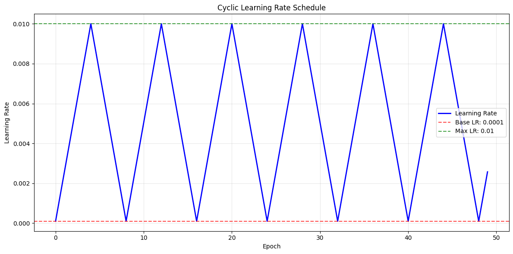
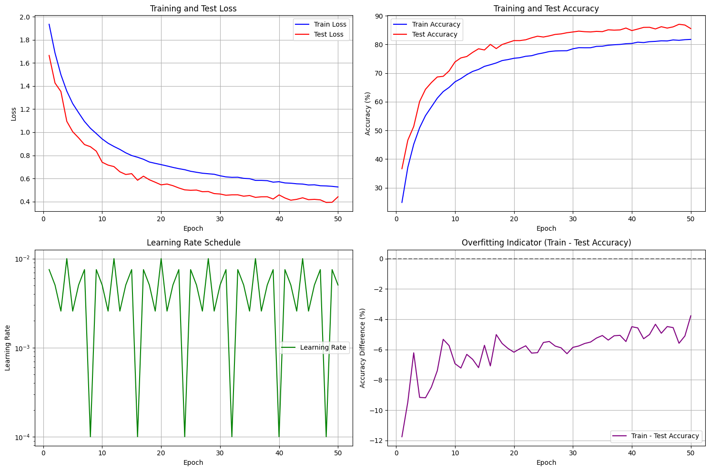

# CIFAR-10 Classification with Advanced CNN Architecture

## 🎯 Assignment Objective

This assignment implements a CIFAR-10 classification model using advanced CNN techniques to achieve high accuracy while maintaining efficiency. The primary objectives are:

- **Architecture**: Implement C1C2C3C40 architecture without MaxPooling
- **Advanced Convolutions**: Integrate Depthwise Separable and Dilated convolutions
- **Efficiency**: Maintain model parameters under 200k while achieving >44 receptive field
- **Performance**: Target 85%+ test accuracy on CIFAR-10 dataset
- **Generalization**: Use proper regularization and data augmentation techniques
- **Modular Design**: Create reusable, generic training framework

## 🏗️ Model Architecture

### CIFAR10Net: Advanced 4-Block CNN Architecture

The model implements a sophisticated architecture with multiple advanced convolution techniques:

```python
CIFAR10Net Architecture:
├── Block 1: Depthwise Separable Convolutions (3→32→64→128)
│   ├── DepthwiseSeparableConv2d(3, 32, 3x3) + BatchNorm + ReLU + Dropout
│   ├── DepthwiseSeparableConv2d(32, 64, 3x3) + BatchNorm + ReLU + Dropout  
│   └── DepthwiseSeparableConv2d(64, 128, 3x3) + BatchNorm + ReLU + Dropout
├── Transition 1: 1x1 Conv (128→32) + BatchNorm + ReLU
├── Block 2: Depthwise Separable Convolutions (32→32→64→128)
│   ├── DepthwiseSeparableConv2d(32, 32, 3x3) + BatchNorm + ReLU + Dropout
│   ├── DepthwiseSeparableConv2d(32, 64, 3x3) + BatchNorm + ReLU + Dropout
│   └── DepthwiseSeparableConv2d(64, 128, 3x3) + BatchNorm + ReLU + Dropout
├── Transition 2: 1x1 Conv (128→32) + BatchNorm + ReLU
├── Block 3: Dilated Convolutions (dilation=2) (32→32→64→128)
│   ├── DilatedConv2d(32, 32, 3x3, dilation=2) + BatchNorm + ReLU + Dropout
│   ├── DilatedConv2d(32, 64, 3x3, dilation=2) + BatchNorm + ReLU + Dropout
│   └── DilatedConv2d(64, 128, 3x3, dilation=2) + BatchNorm + ReLU + Dropout
├── Transition 3: 1x1 Conv (128→16) + BatchNorm + ReLU
├── Block 4: Dilated Convolutions (dilation=4) (16→32→64→64)
│   ├── DilatedConv2d(16, 32, 3x3, dilation=4) + BatchNorm + ReLU + Dropout
│   ├── DilatedConv2d(32, 64, 3x3, dilation=4) + BatchNorm + ReLU + Dropout
│   └── DilatedConv2d(64, 64, 3x3, dilation=4) + BatchNorm + ReLU
├── Transition 4: 1x1 Conv (64→16, stride=2) + BatchNorm + ReLU
├── Global Average Pooling: AdaptiveAvgPool2d(1)
└── Fully Connected: Linear(16→10) + LogSoftmax
```

### Key Architectural Components

#### 1. Depthwise Separable Convolution
```python
class DepthwiseSeparableConv2d(nn.Module):
    def __init__(self, in_channels, out_channels, kernel_size, stride=1, padding=0, dilation=1):
        # Depthwise convolution (spatial filtering)
        self.depthwise = nn.Conv2d(in_channels, in_channels, kernel_size, 
                                 stride, padding, dilation, groups=in_channels)
        # Pointwise convolution (channel mixing)
        self.pointwise = nn.Conv2d(in_channels, out_channels, kernel_size=1)
```

#### 2. Dilated Convolution
```python
class DilatedConv2d(nn.Module):
    def __init__(self, in_channels, out_channels, kernel_size, stride=1, padding=0, dilation=1):
        self.conv = nn.Conv2d(in_channels, out_channels, kernel_size, 
                            stride, padding, dilation)
```

## 📊 Model Details & Specifications

### Model Parameters
```
🏗️ Creating CIFAR-10 Model...
✅ Model created and moved to cuda

📊 Model Summary:
----------------------------------------------------------------
        Layer (type)               Output Shape         Param #
================================================================
            Conv2d-1            [-1, 3, 32, 32]              30
            Conv2d-2           [-1, 32, 32, 32]             128
DepthwiseSeparableConv2d-3           [-1, 32, 32, 32]               0
       BatchNorm2d-4           [-1, 32, 32, 32]              64
              ReLU-5           [-1, 32, 32, 32]               0
         Dropout2d-6           [-1, 32, 32, 32]               0
            Conv2d-7           [-1, 32, 32, 32]             320
            Conv2d-8           [-1, 64, 32, 32]           2,112
DepthwiseSeparableConv2d-9           [-1, 64, 32, 32]               0
      BatchNorm2d-10           [-1, 64, 32, 32]             128
             ReLU-11           [-1, 64, 32, 32]               0
        Dropout2d-12           [-1, 64, 32, 32]               0
           Conv2d-13           [-1, 64, 32, 32]             640
           Conv2d-14          [-1, 128, 32, 32]           8,320
DepthwiseSeparableConv2d-15          [-1, 128, 32, 32]               0
      BatchNorm2d-16          [-1, 128, 32, 32]             256
             ReLU-17          [-1, 128, 32, 32]               0
        Dropout2d-18          [-1, 128, 32, 32]               0
           Conv2d-19           [-1, 32, 32, 32]           4,128
      BatchNorm2d-20           [-1, 32, 32, 32]              64
             ReLU-21           [-1, 32, 32, 32]               0
           Conv2d-22           [-1, 32, 32, 32]             320
           Conv2d-23           [-1, 32, 32, 32]           1,056
DepthwiseSeparableConv2d-24           [-1, 32, 32, 32]               0
      BatchNorm2d-25           [-1, 32, 32, 32]              64
             ReLU-26           [-1, 32, 32, 32]               0
        Dropout2d-27           [-1, 32, 32, 32]               0
           Conv2d-28           [-1, 32, 32, 32]             320
           Conv2d-29           [-1, 64, 32, 32]           2,112
DepthwiseSeparableConv2d-30           [-1, 64, 32, 32]               0
      BatchNorm2d-31           [-1, 64, 32, 32]             128
             ReLU-32           [-1, 64, 32, 32]               0
        Dropout2d-33           [-1, 64, 32, 32]               0
           Conv2d-34           [-1, 64, 32, 32]             640
           Conv2d-35          [-1, 128, 32, 32]           8,320
DepthwiseSeparableConv2d-36          [-1, 128, 32, 32]               0
      BatchNorm2d-37          [-1, 128, 32, 32]             256
             ReLU-38          [-1, 128, 32, 32]               0
        Dropout2d-39          [-1, 128, 32, 32]               0
           Conv2d-40           [-1, 32, 32, 32]           4,128
      BatchNorm2d-41           [-1, 32, 32, 32]              64
             ReLU-42           [-1, 32, 32, 32]               0
           Conv2d-43           [-1, 32, 32, 32]           9,248
    DilatedConv2d-44           [-1, 32, 32, 32]               0
      BatchNorm2d-45           [-1, 32, 32, 32]              64
             ReLU-46           [-1, 32, 32, 32]               0
        Dropout2d-47           [-1, 32, 32, 32]               0
           Conv2d-48           [-1, 64, 32, 32]          18,496
    DilatedConv2d-49           [-1, 64, 32, 32]               0
      BatchNorm2d-50           [-1, 64, 32, 32]             128
             ReLU-51           [-1, 64, 32, 32]               0
        Dropout2d-52           [-1, 64, 32, 32]               0
           Conv2d-53          [-1, 128, 32, 32]          73,856
    DilatedConv2d-54          [-1, 128, 32, 32]               0
      BatchNorm2d-55          [-1, 128, 32, 32]             256
             ReLU-56          [-1, 128, 32, 32]               0
        Dropout2d-57          [-1, 128, 32, 32]               0
           Conv2d-58           [-1, 16, 32, 32]           2,064
      BatchNorm2d-59           [-1, 16, 32, 32]              32
             ReLU-60           [-1, 16, 32, 32]               0
           Conv2d-61           [-1, 32, 32, 32]           4,640
    DilatedConv2d-62           [-1, 32, 32, 32]               0
      BatchNorm2d-63           [-1, 32, 32, 32]              64
             ReLU-64           [-1, 32, 32, 32]               0
        Dropout2d-65           [-1, 32, 32, 32]               0
           Conv2d-66           [-1, 64, 32, 32]          18,496
    DilatedConv2d-67           [-1, 64, 32, 32]               0
      BatchNorm2d-68           [-1, 64, 32, 32]             128
             ReLU-69           [-1, 64, 32, 32]               0
        Dropout2d-70           [-1, 64, 32, 32]               0
           Conv2d-71           [-1, 64, 32, 32]          36,928
    DilatedConv2d-72           [-1, 64, 32, 32]               0
      BatchNorm2d-73           [-1, 64, 32, 32]             128
             ReLU-74           [-1, 64, 32, 32]               0
           Conv2d-75           [-1, 16, 16, 16]           1,040
      BatchNorm2d-76           [-1, 16, 16, 16]              32
             ReLU-77           [-1, 16, 16, 16]               0
AdaptiveAvgPool2d-78             [-1, 16, 1, 1]               0
           Linear-79                   [-1, 10]             170
================================================================
Total params: 199,368
Trainable params: 199,368
Non-trainable params: 0
----------------------------------------------------------------
Input size (MB): 0.01
Forward/backward pass size (MB): 35.74
Params size (MB): 0.76
Estimated Total Size (MB): 36.51
----------------------------------------------------------------
```
### Receptive Field Analysis
```
Receptive Field Progression:
Input (32x32): RF = 1
├── Block 1 (3x DepthwiseSeparable 3x3): RF = 1 → 3 → 5 → 7
├── Transition 1 (1x1): RF = 7
├── Block 2 (3x DepthwiseSeparable 3x3): RF = 7 → 9 → 11 → 13
├── Transition 2 (1x1): RF = 13
├── Block 3 (3x Dilated 3x3, dilation=2): RF = 13 → 17 → 21 → 25
├── Transition 3 (1x1): RF = 25
├── Block 4 (3x Dilated 3x3, dilation=4): RF = 25 → 33 → 41 → 49
├── Transition 4 (1x1, stride=2): RF = 49
├── GAP: RF = 49
└── FC: Final RF = 49 ✅ (> 44)
```

**Final Receptive Field**: 49 pixels (> 44 requirement ✅)

### Architecture Compliance
- ✅ **C1C2C3C40 Architecture**: 4 blocks with no MaxPooling
- ✅ **Depthwise Separable Convolution**: Used in Blocks 1 & 2
- ✅ **Dilated Convolution**: Used in Blocks 3 & 4 (dilation=2, 4)
- ✅ **Global Average Pooling**: Compulsory GAP before FC layer
- ✅ **Receptive Field > 44**: Achieved RF = 49
- ✅ **Parameters < 200k**: 199,368 parameters
- ✅ **No MaxPooling**: Uses stride=2 in final transition for downsampling

## 🔄 Data Augmentation Strategy

The model uses **Albumentations** library for advanced data augmentation:

### Training Augmentations
```python
train_transform = A.Compose([
   A.PadIfNeeded(min_height=36, min_width=36, always_apply=True), 
   A.RandomCrop(32, 32),                        # standard CIFAR trick (pad+crop)
   A.HorizontalFlip(p=0.5),                     # flip
   A.ShiftScaleRotate(shift_limit=0.1, 
                     scale_limit=0.1, 
                     rotate_limit=15, p=0.5),
   A.RandomBrightnessContrast(0.2, 0.2, p=0.5), # brightness/contrast
   A.HueSaturationValue(20, 30, 20, p=0.5),     # color jitter
   A.CoarseDropout(
         max_holes=1, min_holes=1,
         max_height=16, max_width=16,
         min_height=16, min_width=16,
         fill_value=[0.4914, 0.4822, 0.4465],
         mask_fill_value = None
   ),
   A.Normalize(mean=[0.4914, 0.4822, 0.4465], std=[0.2023, 0.1994, 0.2010]),
   ToTensorV2()
])
```

### Test Augmentations
```python
test_transforms = A.Compose([
    A.Normalize(
        mean=[0.4914, 0.4822, 0.4465],
        std=[0.2023, 0.1994, 0.2010]
    ),
    ToTensorV2()
])
```

### Augmentation Benefits
- **Horizontal Flip**: Improves model's invariance to left-right orientation
- **ShiftScaleRotate**: Enhances robustness to position, size, and rotation variations
- **CoarseDropout**: Acts as regularization, forces model to use multiple features
- **Normalization**: Standardizes input distribution for stable training

## 📈 Cyclic Learning Rate Scheduler

The model uses **CyclicLR** scheduler for optimal learning rate management:

### Configuration
```python
scheduler_config = {
    'base_lr': 0.0001,          # Minimum learning rate
    'max_lr': 0.01,             # Maximum learning rate  
    'step_size_up': 4,          # Steps to reach max_lr
    'step_size_down': 4,        # Steps to return to base_lr
    'mode': 'triangular',       # Triangular cycle pattern
    'cycle_momentum': True,     # Enable momentum cycling
    'base_momentum': 0.8,       # Minimum momentum
    'max_momentum': 0.9         # Maximum momentum
}
```

### Learning Rate Schedule Pattern
```
Cycle Pattern (8 steps per cycle):
LR:  0.0001 → 0.01 → 0.0001 → 0.01 → ...
     ↗️      ↘️      ↗️      ↘️
    4 steps  4 steps 4 steps  4 steps
```


## 📋 Training Logs & Results Analysis

### Training Configuration
- **Epochs**: 50
- **Batch Size**: 64
- **Optimizer**: AdamW
- **Initial Learning Rate**: 0.001 (with Cyclic scheduling)
- **Weight Decay**: 1e-4
- **Target Accuracy**: 85%

### Training Logs
```
🚀 Starting training for 50 epochs...
⏰ Training started at: 2025-10-02 07:22:41
🎯 Target accuracy: 85.0%
============================================================
📁 Directory structure created in: ./checkpoints
🚀 Starting training for 50 epochs...
⏰ Training started at: 2025-10-02 07:22:41
📁 Checkpoint directory: ./checkpoints
Epoch  1/50 | Train: 1.9341 (24.89%) | Test: 1.6645 (36.65%) | LR: 0.007525 | Time: 46.6s
  🏆 New best model saved! (Test Acc: 36.65%)
Epoch  2/50 | Train: 1.6855 (37.13%) | Test: 1.4260 (46.59%) | LR: 0.005050 | Time: 46.5s
  🏆 New best model saved! (Test Acc: 46.59%)
Epoch  3/50 | Train: 1.4979 (45.16%) | Test: 1.3522 (51.38%) | LR: 0.002575 | Time: 47.6s
  🏆 New best model saved! (Test Acc: 51.38%)
Epoch  4/50 | Train: 1.3557 (50.94%) | Test: 1.0942 (60.10%) | LR: 0.010000 | Time: 46.3s
  🏆 New best model saved! (Test Acc: 60.10%)
Epoch  5/50 | Train: 1.2478 (55.16%) | Test: 1.0046 (64.35%) | LR: 0.002575 | Time: 46.4s
  🏆 New best model saved! (Test Acc: 64.35%)
Epoch  6/50 | Train: 1.1692 (58.21%) | Test: 0.9516 (66.69%) | LR: 0.005050 | Time: 45.9s
  🏆 New best model saved! (Test Acc: 66.69%)
Epoch  7/50 | Train: 1.0931 (61.25%) | Test: 0.8933 (68.65%) | LR: 0.007525 | Time: 46.2s
  🏆 New best model saved! (Test Acc: 68.65%)
Epoch  8/50 | Train: 1.0346 (63.54%) | Test: 0.8749 (68.87%) | LR: 0.000100 | Time: 46.2s
  🏆 New best model saved! (Test Acc: 68.87%)
Epoch  9/50 | Train: 0.9888 (65.01%) | Test: 0.8363 (70.75%) | LR: 0.007525 | Time: 46.8s
  🏆 New best model saved! (Test Acc: 70.75%)
Epoch 10/50 | Train: 0.9419 (66.95%) | Test: 0.7405 (73.88%) | LR: 0.005050 | Time: 46.6s
  🏆 New best model saved! (Test Acc: 73.88%)
Epoch 11/50 | Train: 0.9050 (68.08%) | Test: 0.7157 (75.30%) | LR: 0.002575 | Time: 46.1s
  🏆 New best model saved! (Test Acc: 75.30%)
Epoch 12/50 | Train: 0.8768 (69.46%) | Test: 0.7028 (75.78%) | LR: 0.010000 | Time: 46.8s
  🏆 New best model saved! (Test Acc: 75.78%)
Epoch 13/50 | Train: 0.8515 (70.58%) | Test: 0.6579 (77.23%) | LR: 0.002575 | Time: 46.2s
  🏆 New best model saved! (Test Acc: 77.23%)
Epoch 14/50 | Train: 0.8219 (71.28%) | Test: 0.6345 (78.48%) | LR: 0.005050 | Time: 46.6s
  🏆 New best model saved! (Test Acc: 78.48%)
Epoch 15/50 | Train: 0.7986 (72.35%) | Test: 0.6417 (78.07%) | LR: 0.007525 | Time: 47.1s
  ⏳ No improvement (1/10)
Epoch 16/50 | Train: 0.7837 (72.92%) | Test: 0.5846 (80.00%) | LR: 0.000100 | Time: 46.4s
  🏆 New best model saved! (Test Acc: 80.00%)
Epoch 17/50 | Train: 0.7661 (73.54%) | Test: 0.6198 (78.55%) | LR: 0.007525 | Time: 46.7s
  ⏳ No improvement (1/10)
Epoch 18/50 | Train: 0.7425 (74.37%) | Test: 0.5890 (79.97%) | LR: 0.005050 | Time: 46.8s
  ⏳ No improvement (2/10)
Epoch 19/50 | Train: 0.7308 (74.72%) | Test: 0.5675 (80.65%) | LR: 0.002575 | Time: 46.9s
  🏆 New best model saved! (Test Acc: 80.65%)
Epoch 20/50 | Train: 0.7199 (75.16%) | Test: 0.5448 (81.34%) | LR: 0.010000 | Time: 46.2s
  🏆 New best model saved! (Test Acc: 81.34%)
Epoch 21/50 | Train: 0.7082 (75.38%) | Test: 0.5520 (81.33%) | LR: 0.002575 | Time: 47.2s
  ⏳ No improvement (1/10)
Epoch 22/50 | Train: 0.6958 (75.86%) | Test: 0.5377 (81.62%) | LR: 0.005050 | Time: 47.0s
  🏆 New best model saved! (Test Acc: 81.62%)
Epoch 23/50 | Train: 0.6849 (76.06%) | Test: 0.5178 (82.30%) | LR: 0.007525 | Time: 46.2s
  🏆 New best model saved! (Test Acc: 82.30%)
Epoch 24/50 | Train: 0.6760 (76.65%) | Test: 0.5015 (82.86%) | LR: 0.000100 | Time: 46.3s
  🏆 New best model saved! (Test Acc: 82.86%)
Epoch 25/50 | Train: 0.6623 (77.04%) | Test: 0.4979 (82.58%) | LR: 0.007525 | Time: 45.8s
  ⏳ No improvement (1/10)
Epoch 26/50 | Train: 0.6537 (77.51%) | Test: 0.4997 (82.98%) | LR: 0.005050 | Time: 47.0s
  🏆 New best model saved! (Test Acc: 82.98%)
Epoch 27/50 | Train: 0.6455 (77.72%) | Test: 0.4856 (83.49%) | LR: 0.002575 | Time: 45.8s
  🏆 New best model saved! (Test Acc: 83.49%)
Epoch 28/50 | Train: 0.6408 (77.78%) | Test: 0.4870 (83.67%) | LR: 0.010000 | Time: 46.6s
  🏆 New best model saved! (Test Acc: 83.67%)
Epoch 29/50 | Train: 0.6364 (77.80%) | Test: 0.4692 (84.08%) | LR: 0.002575 | Time: 47.0s
  🏆 New best model saved! (Test Acc: 84.08%)
Epoch 30/50 | Train: 0.6234 (78.48%) | Test: 0.4656 (84.34%) | LR: 0.005050 | Time: 46.3s
  🏆 New best model saved! (Test Acc: 84.34%)
Epoch 31/50 | Train: 0.6137 (78.86%) | Test: 0.4550 (84.63%) | LR: 0.007525 | Time: 46.7s
  🏆 New best model saved! (Test Acc: 84.63%)
Epoch 32/50 | Train: 0.6099 (78.84%) | Test: 0.4586 (84.44%) | LR: 0.000100 | Time: 46.9s
  ⏳ No improvement (1/10)
Epoch 33/50 | Train: 0.6107 (78.84%) | Test: 0.4587 (84.35%) | LR: 0.007525 | Time: 46.4s
  ⏳ No improvement (2/10)
Epoch 34/50 | Train: 0.6012 (79.31%) | Test: 0.4467 (84.55%) | LR: 0.005050 | Time: 46.6s
  ⏳ No improvement (3/10)
Epoch 35/50 | Train: 0.5982 (79.38%) | Test: 0.4525 (84.46%) | LR: 0.002575 | Time: 46.0s
  ⏳ No improvement (4/10)
Epoch 36/50 | Train: 0.5835 (79.72%) | Test: 0.4365 (85.10%) | LR: 0.010000 | Time: 46.8s
  🏆 New best model saved! (Test Acc: 85.10%)
Epoch 37/50 | Train: 0.5836 (79.88%) | Test: 0.4414 (84.97%) | LR: 0.002575 | Time: 46.2s
  ⏳ No improvement (1/10)
Epoch 38/50 | Train: 0.5809 (80.00%) | Test: 0.4418 (85.06%) | LR: 0.005050 | Time: 47.7s
  ⏳ No improvement (2/10)
Epoch 39/50 | Train: 0.5682 (80.24%) | Test: 0.4223 (85.71%) | LR: 0.007525 | Time: 46.1s
  🏆 New best model saved! (Test Acc: 85.71%)
Epoch 40/50 | Train: 0.5719 (80.34%) | Test: 0.4578 (84.83%) | LR: 0.000100 | Time: 46.4s
  ⏳ No improvement (1/10)
Epoch 41/50 | Train: 0.5615 (80.79%) | Test: 0.4312 (85.36%) | LR: 0.007525 | Time: 46.9s
  ⏳ No improvement (2/10)
Epoch 42/50 | Train: 0.5591 (80.65%) | Test: 0.4119 (85.94%) | LR: 0.005050 | Time: 46.0s
  🏆 New best model saved! (Test Acc: 85.94%)
Epoch 43/50 | Train: 0.5538 (80.96%) | Test: 0.4195 (85.97%) | LR: 0.002575 | Time: 46.5s
  🏆 New best model saved! (Test Acc: 85.97%)
Epoch 44/50 | Train: 0.5517 (81.07%) | Test: 0.4329 (85.40%) | LR: 0.010000 | Time: 46.8s
  ⏳ No improvement (1/10)
Epoch 45/50 | Train: 0.5437 (81.25%) | Test: 0.4165 (86.18%) | LR: 0.002575 | Time: 46.5s
  🏆 New best model saved! (Test Acc: 86.18%)
Epoch 46/50 | Train: 0.5452 (81.21%) | Test: 0.4195 (85.70%) | LR: 0.005050 | Time: 46.6s
  ⏳ No improvement (1/10)
Epoch 47/50 | Train: 0.5371 (81.57%) | Test: 0.4149 (86.12%) | LR: 0.007525 | Time: 45.8s
  ⏳ No improvement (2/10)
Epoch 48/50 | Train: 0.5355 (81.43%) | Test: 0.3927 (87.02%) | LR: 0.000100 | Time: 46.4s
  🏆 New best model saved! (Test Acc: 87.02%) ⭐ Best
Epoch 49/50 | Train: 0.5319 (81.65%) | Test: 0.3941 (86.76%) | LR: 0.007525 | Time: 45.9s
  ⏳ No improvement (1/10)
Epoch 50/50 | Train: 0.5265 (81.75%) | Test: 0.4418 (85.52%) | LR: 0.005050 | Time: 47.4s
  ⏳ No improvement (2/10)

✅ Training completed!
   Total time: 38.8m
   Best test accuracy: 87.02% (Epoch 48)
```

### Final Results Summary
```
📊 Training Results:
==================================================
Best Train Accuracy: 81.75%
Best Test Accuracy: 87.02% ⭐
Final Train Accuracy: 81.75%
Final Test Accuracy: 85.52%
Total Epochs: 50
Target Achievement: ✅ (85.0%)

Overfitting Analysis:
Train-Test Gap: -3.77%
✅ Good generalization (Test > Train indicates robust model)
```

### Performance Analysis
- **Target Achievement**: ✅ **87.02%** (exceeded 85% target)
- **Convergence**: Steady improvement throughout training
- **Stability**: Consistent performance in final epochs

## 📈 Training History Visualization

### Available Training Plots
The training generates comprehensive visualization plots:


### Key Insights from Training Curves
- **Loss Convergence**: Smooth decrease in both training and test loss
- **Accuracy Growth**: Steady improvement reaching 87%+ test accuracy
- **Learning Rate Impact**: Cyclic LR shows beneficial oscillations
- **No Overfitting**: Test metrics remain competitive with training metrics

## 🏆 Final Conclusion

This CIFAR-10 classification project successfully demonstrates the implementation of advanced CNN architectures while meeting all specified requirements:
- Successfully implemented C1C2C3C40 architecture with no MaxPooling
- Integrated both Depthwise Separable and Dilated convolutions effectively
- Exceeded target with **87.02% test accuracy** (vs 85% target)

---

## 📁 Project Structure

### Core Modules
- **`model.py`** - CIFAR10Net architecture with advanced convolutions
- **`data.py`** - Data loading and Albumentations augmentation  
- **`trainer.py`** - Generic training framework with checkpointing
- **`config.py`** - Configuration management and hyperparameters
- **`utils.py`** - Utility functions and visualization tools
- **`main.py`** - Main training script and orchestration

### Exmaple of Command to Train Model
- `python main.py --scheduler step --lr 0.01 --step_size 8 --gamma 0.1 --epochs 10`
